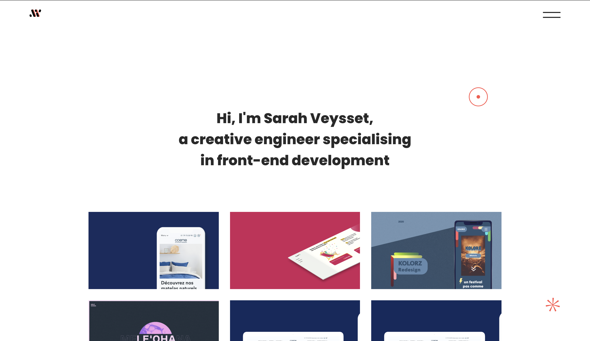

# My portfolio 💻

*IMAC Semester 5 project* • Professor : NANNI Laetitia

### Authors: Sarah VEYSSET



## Table of contents

* [**The instructions**](#the-instructions)
    + [**Create a portfolio using a Js framework**](#create-a-portfolio-using-a-js-framework)
    + [**Integrate the following elements**](#integrate-the-following-elements)
* [**What I use**](#what-i-use)
* [**How To**](#how-to)
    + [**Install Node Libraries**](#install-node-libraries)
    + [**Run Server**](#run-server)
    + [**For Developpers**](#for-developpers)
        - [**Check JS Syntax with Eslint**](#check-js-syntax-with-eslint)
        - [**Compiles and minifies for production**](#compiles-and-minifies-for-production)

## The instructions

### Create a portfolio using a Js framework

I chose to develop a portfolio in order to present my projects and to have a presentation support for eventual questions. I chose the VueJs framework for its simplicity, flexibility and performance.

### Integrate the following elements

#### Integrate an interactive 3D or 2D canvas

- [x] In my portfolio, I chose to create a space called "Playground". Inside, a canva2D allows to visualize red circles walking in the space. In addition, the user can add random size black circles to the click.

#### Minimum 2 routes with custom transition between the 2

- [x] I have created many transitions throughout the site: 
    - one between the main pages of the portfolio (slide-left or slide-right)
    - one for displaying the project page and the playground (opacity)
    - one for the display of the upper navbar (opacity and translate)
    - one for menu deployment (translate)
    - one for displaying projects on the home page (opacity and translate with setTimeout)

#### Embedding JS animations via [gsap](https://greensock.com/gsap/) or animateJS or other...

- [x] I used the GSAP library to create scroll animations.
    - This animation is present on the project pages in order to rotate an object with a scroll.
- [x] I used the AOS (Animate On Scroll) library to make elements appear on the scroll.
- [x] I have also created many animations without libraries (simply SCSS or Js) :
    - cursor animation
    - switch animation on some buttons (hover)
    - menu button animation (hover and click)
    - parallax effect on iphones in the project page

#### Responsive and with good browser compatibility

- [x] The responsive has been designed for large screens, tablets and telephones. 

## What I use

- The VueJs framework: https://vuejs.org/
- The GSAP (Green Sock) bookshop: https://greensock.com/gsap/
- The AOS (Animate On Scroll) bookshop: https://michalsnik.github.io/aos/

## How To

### Clone the project

You can clone the repository in your folder.

```
git clone https://github.com/sarah2627/portfolio.git
```

### Install Node Libraries

The first thing to do is to install the libraries.
Open a shell inside the root folder.

```bash
npm install
```

Now, you should have a sub-folder *node_modules*.

### Run Server // Compiles and hot-reloads for development

```
npm run serve
```

The server will be opened on *localhost:8080*.
To make it stop, use Ctrl+C.

### For Developpers

#### Check JS Syntax with linter

For developers only: To make sure the code is well written, please run this command several times during your development work.

```bash
npm run lint
```

If nothing happens, everything is right. Else, warnings or errors will be written there.

#### Compiles and minifies for production
```
npm run build
```
